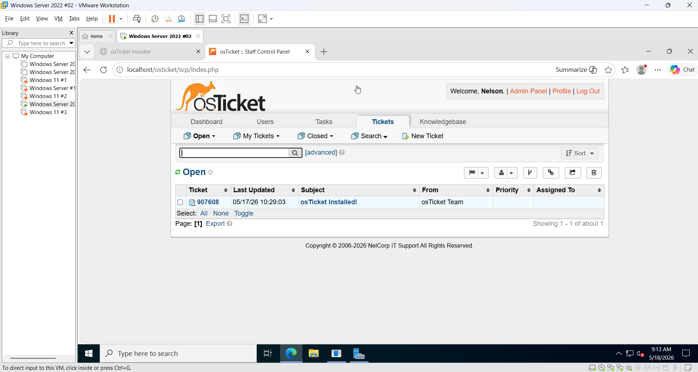

# Help Desk Ticketing Lab

## Project Overview / Objective
This project simulates a real-world IT Help Desk environment using osTicket on Windows Server 2022. Users can submit support tickets while IT staff manage, prioritize, assign, and resolve issues through a structured ticketing workflow.

## Technologies Used
- Windows Server 2022
- Internet Information Services
- PHP
- MySQL
- osTicket
- VMware Workstation

## Lab Environment

- Windows Server 2022 VM (Help Desk Server)
- Windows 11 VM (Client Machine)
- Host-only network configuration
- Static IP configured on server
- Web server running IIS to host osTicket
- Web server running MYSQL to manage osTicket database

## Features Implemented

- Ticket submission portal
- Department creation
- Agents creation
- Role-based access control
- Ticket assignment and prioritization
- Internal ticket notes
- Ticket resolution and closure

## Example Tickets

- Password reset request
- Wi-Fi connectivity issue
- Printer malfunction
- Slow computer

## Screenshots

### Ticket Dashboard

## Skills Learned

- IIS configuration and management
- PHP integration with IIS
- MySQL database setup
- Help desk ticket lifecycle management
- Role-based access control
- IT support workflow
